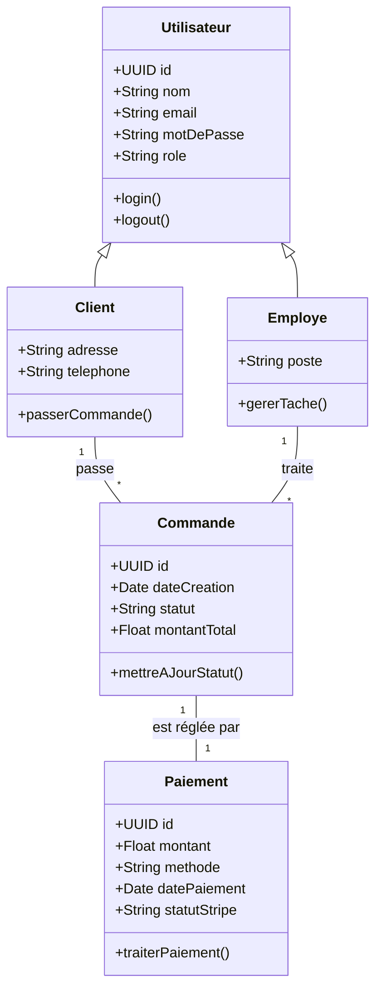
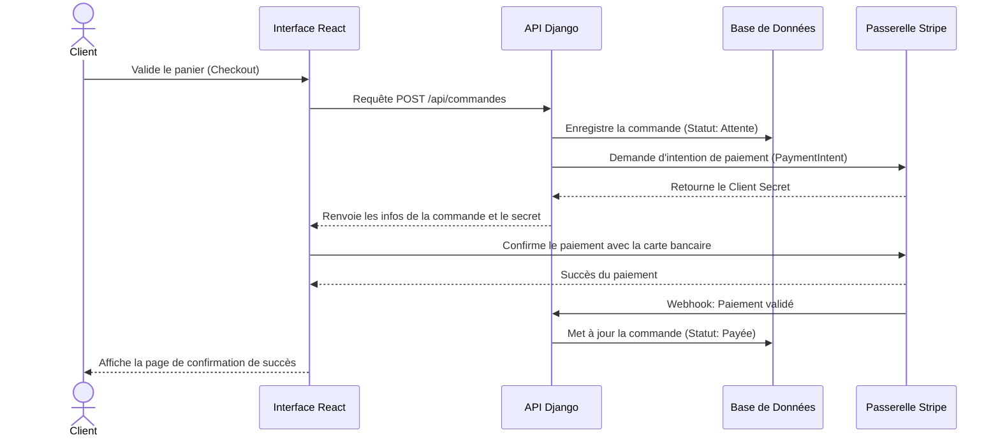

# Diagrammes du Projet Proph Couture

Ce document contient les modélisations principales de l'application. Vous pouvez visualiser ces diagrammes directement dans votre éditeur (comme VS Code) en utilisant une extension Markdown ou Mermaid (ex: "Markdown Preview Mermaid Support").

## 1. Diagramme des Cas d'Utilisation

L'interaction des différents acteurs avec le système.

```mermaid
usecaseDiagram
    actor Client
    actor Admin
    actor Tailleur

    package Système_Proph_Couture {
        usecase "S'authentifier" as UC1
        usecase "Passer une commande" as UC2
        usecase "Effectuer un paiement (Stripe)" as UC3
        usecase "Suivre ses commandes" as UC4
        usecase "Gérer les employés/apprentis" as UC5
        usecase "Voir le tableau de bord financier" as UC6
        usecase "Gérer l'état des commandes" as UC7
    }

    Client --> UC1
    Client --> UC2
    Client --> UC3
    Client --> UC4

    Admin --> UC1
    Admin --> UC5
    Admin --> UC6
    Admin --> UC7

    Tailleur --> UC1
    Tailleur --> UC7
```

## 2. Diagramme de Classes

La structure simplifiée des données de l'application.



## 3. Diagramme de Séquence (Processus de Commande & Paiement)

Le parcours d'un client lors de la validation du panier et du paiement.


