# Diagrammes de Séquence - Proph Couture

Ce document contient les diagrammes de séquence du projet **Proph Couture**.
Puisque l'extension Draw.io nécessite des coordonnées absolues complexes pour ses fichiers `.drawio` natifs, la méthode la plus **propre et structurée** est d'utiliser le support natif de **Mermaid** intégré dans Draw.io.

## 🛠️ Comment importer ces diagrammes dans Draw.io

1. Ouvrez un fichier `.drawio` vide dans VS Code (via l'extension Draw.io).
2. Dans le menu du haut, cliquez sur **Arrange** (Organiser) > **Insert** (Insérer) > **Advanced** (Avancé) > **Mermaid...**
3. Copiez le code Mermaid d'un des diagrammes ci-dessous et collez-le dans la fenêtre.
4. Cliquez sur **Insert**. Draw.io générera automatiquement le diagramme avec une mise en page parfaite !

---

## 1. Diagramme de Séquence : Authentification (Inscription & Connexion)

Ce diagramme illustre le flux lorsqu'un utilisateur s'inscrit puis se connecte à l'application.

```mermaid
sequenceDiagram
    autonumber
    actor Client
    participant Frontend as Frontend (React)
    participant AuthAPI as API Auth (authAPI)
    participant Backend as Backend (Django)
    participant DB as Base de Données

    %% Inscription
    rect rgb(30, 30, 30)
    Note over Client, DB: Processus d'Inscription (Register)
    Client->>Frontend: Remplit le formulaire d'inscription
    Frontend->>AuthAPI: authAPI.register(data)
    AuthAPI->>Backend: POST /api/users/register/
    Backend->>Backend: Validation des attributs (email, mot de passe)
    Backend->>DB: Création de l'utilisateur
    DB-->>Backend: Utilisateur créé avec succès
    Backend-->>AuthAPI: 201 Created (Token + Infos Utilisateur)
    AuthAPI-->>Frontend: Stockage token (localStorage)
    Frontend-->>Client: Redirection vers l'accueil / tableau de bord
    end

    %% Connexion
    rect rgb(40, 40, 40)
    Note over Client, DB: Processus de Connexion (Login)
    Client->>Frontend: Saisit Email & Mot de passe
    Frontend->>AuthAPI: authAPI.login(credentials)
    AuthAPI->>Backend: POST /api/users/login/
    Backend->>DB: Vérification des identifiants
    DB-->>Backend: Identifiants valides
    Backend-->>AuthAPI: 200 OK (access_token, refresh_token, user_data)
    AuthAPI->>Frontend: Sauvegarde dans localStorage
    Frontend-->>Client: Redirection vers le tableau de bord
    end

    autonumber
    actor Client
    participant Frontend as Frontend (Cart/Checkout)
    participant OrderAPI as API Commandes (orderAPI)
    participant Backend as Backend (OrderViewSet)
    participant DB as Base de Données

    Client->>Frontend: Ajoute des produits au panier
    Client->>Frontend: Clique sur "Valider la commande" (Checkout)
    Frontend->>Frontend: Vérifie si l'utilisateur est connecté
    Frontend->>OrderAPI: orderAPI.create(cart_data, address)
    Note right of OrderAPI: Le Token JWT est attaché aux headers
    OrderAPI->>Backend: POST /api/orders/create/
    
    Backend->>Backend: Validation du payload et du Stock
    Backend->>DB: Sauvegarde la Commande (Order)
    Backend->>DB: Sauvegarde les articles (OrderItems)
    DB-->>Backend: Commande enregistrée (Status: pending)
    
    Backend-->>OrderAPI: 201 Created (Order_Number, Total_Amount)
    OrderAPI-->>Frontend: Redirection vers le paiement
    Frontend-->>Client: Affiche la page de choix de paiement

    autonumber
    actor Client
    participant Frontend as Frontend (Payment Page)
    participant PaymentAPI as API Paiement (orderAPI)
    participant Backend as Backend (InitiatePaymentView)
    participant Nelsius as Service Nelsius (Provider API)
    participant DB as Base de Données

    Client->>Frontend: Sélectionne "Mobile Money" & Confirme
    Frontend->>PaymentAPI: orderAPI.initiatePayment(order_number, phone)
    PaymentAPI->>Backend: POST /api/orders/{order_number}/initiate-payment/
    
    Backend->>DB: Récupère la commande & vérifie le montant
    DB-->>Backend: Commande valide (Status: pending)
    
    Backend->>Nelsius: NelsiusService.create_payment(order, customer_info)
    Nelsius-->>Backend: Succès (payment_url, transaction_id)
    
    Backend->>DB: Met à jour (transaction_id, payment_method)
    DB-->>Backend: Sauvegarde effectuée
    
    Backend-->>PaymentAPI: 200 OK (payment_url)
    PaymentAPI-->>Frontend: Redirige vers Nelsius checkout
    
    Frontend->>Nelsius: Redirection du navigateur du Client
    Nelsius-->>Client: Demande confirmation USSD/PIN
    Client->>Nelsius: Valide le paiement Mobile Money
    
    Nelsius-->>Frontend: Redirection vers /payment/success/
    
    Frontend->>Backend: POST /api/orders/{order_number}/verify/
    Backend->>Nelsius: NelsiusService.verify_payment(transaction_id)
    Nelsius-->>Backend: Status: "completed"
    
    Backend->>DB: Met à jour la commande (Status: paid)
    Backend->>DB: Déduit les stocks (Inventory)
    DB-->>Backend: Mise à jour terminée
    
    Backend-->>Frontend: 200 OK (Paiement validé)
    Frontend-->>Client: Affiche reçu & confirmation de commande

    autonumber
    actor AdminWorker as Admin / Artisan
    participant Frontend as Tableau de Bord
    participant UserAPI as API Utilisateurs
    participant Backend as Backend (Users/Orders)
    participant DB as Base de Données

    AdminWorker->>Frontend: Accède au profil d'un client
    Frontend->>UserAPI: Récupère les mesures existantes
    UserAPI->>Backend: GET /api/orders/my-measurements/ (ou admin id)
    Backend->>DB: Requête des mesures JSON
    DB-->>Backend: Retourne l'objet Mensurations
    Backend-->>UserAPI: 200 OK
    UserAPI-->>Frontend: Affiche le formulaire pré-rempli
    
    AdminWorker->>Frontend: Modifie les tailles (Buste, Hanches, etc.)
    AdminWorker->>Frontend: Clique sur "Sauvegarder"
    Frontend->>UserAPI: userAPI.saveMeasurements(data)
    UserAPI->>Backend: POST /api/orders/my-measurements/
    
    Backend->>Backend: Validation des champs
    Backend->>DB: Met à jour user.measurements
    DB-->>Backend: Sauvegarde confirmée
    
    Backend-->>UserAPI: 200 OK (Succès)
    UserAPI-->>Frontend: Notification "Mesures sauvegardées"
    Frontend-->>AdminWorker: Affiche les nouvelles mesures
```

